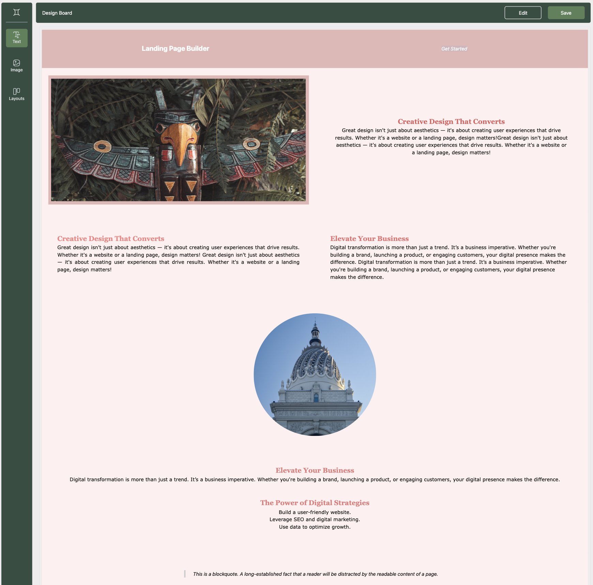
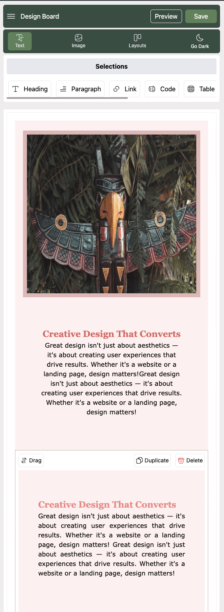
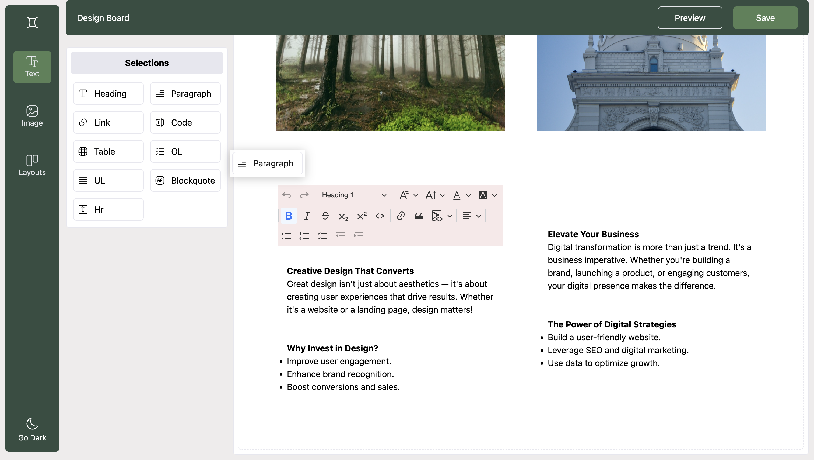
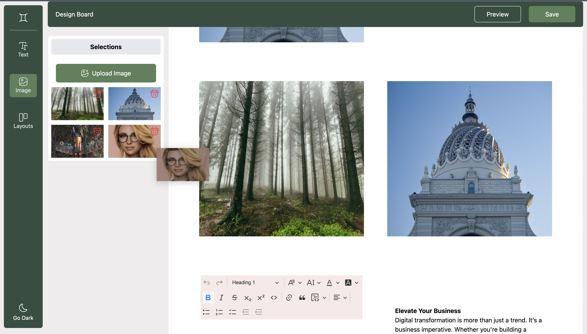
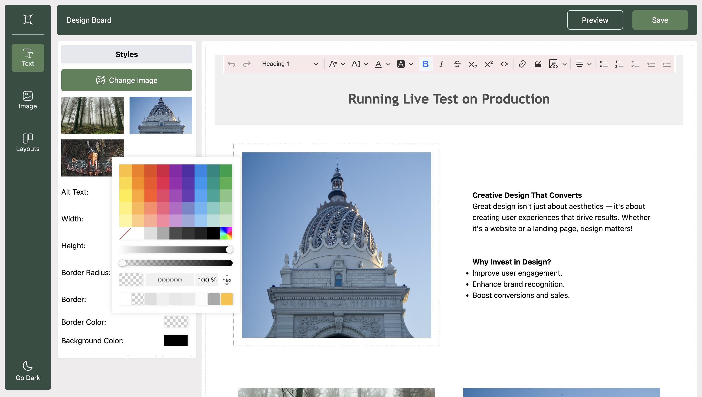
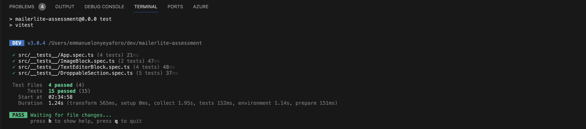
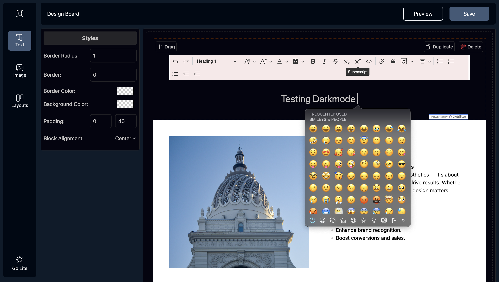

# Landing Page Builder

A simple drag & drop landing page builder created using **Vue 3** 





## Features

- **Draggable Blocks:** Two types of draggable blocks:
  - **Text Block:** Editable content.
  - **Image Block:** Select one of 3-4 predefined images.
  - **Layout Block:** Select a quick layout of images or texts.
  
- **Rearrange, Duplicate, and Delete Blocks:** 
  - Users can drag to rearrange blocks, duplicate them, or remove them.

- **Responsive Design:** Fully responsive UI, ensuring the builder works across different screen sizes.

- **Save to JSON:** Clicking the "Save" button exports the page data (text content, image links, block order, etc.) to the console as a JSON object.

- **Styling:** Built using **TailwindCSS**

## Libraries & Tools

- **Vue 3** – A progressive JavaScript framework.
- **Pinia** – State management for Vue 3.
- **TailwindCSS** – Utility-first CSS framework for fast UI development.
- **CKEditor** – Rich text editor for editing content inside text blocks.
- **Vue Draggle Next** – Drag and drop functionality for movable blocks.
- **Vue 3 Colorpicker** – Colorpicker for customizing block colors.
- **Nanoid** – Unique ID generator for each block.
- **Vitest** – For unit testing.

## Installation

### Prerequisites

- Node.js (version 16.x or higher)
- npm (Node Package Manager)

### Setup

1. Clone the repository:

   ```bash
   git clone https://github.com/keys78/mailerlite-assessment.git
   cd mailerlite-assessment
   ```

2. Install dependencies:

   ```bash
   npm install
   ```

3. Run the development server:

   ```bash
   npm run dev
   ```

   The app should now be running at `http://localhost:5173`.

## Usage

- **Add Text Block:** Drag and drop the Text Block into the builder area. You can edit its content directly.


  
- **Add Image Block:** Drag and drop the Image Block into the builder area. Click on the block to select one of the predefined images.



- **Rearrange Blocks:** Click and drag any block to reorder them.



- **Duplicate Block:** Click the duplicate button on any block to create a copy.

- **Delete Block:** Click the delete button on any block to remove it from the builder.

- **Preview Button:** Click the "Preview" button to view the current state of the landing page.
  
- **Save Button:** Click the "Save" button to export the current state of the landing page in JSON format. The exported JSON will be logged to the console.

## Example Output

Upon saving, the JSON output in the console or alert pop-up will look like this:

```json
[
   {
      "uuid":"XUgf3ykms4pVUUm_tSYOX",
      "blockType":"text",
      "name":"heading",
      "iconName":"heading",
      "content":"<h2 style=\"text-align:center;\"><span class=\"text-huge\">Testing Darkmode&nbsp;</span></h2>",
      "backgroundColor":"transparent",
      "border":"0",
      "borderColor":"transparent",
      "borderRadius":"1",
      "paddingX":"40",
      "paddingY":0,
      "alignment":"center"
   },
   {
      "uuid":"P6BTFuQ9IYaCnORC_6-NQ",
      "blockType":"layout",
      "layoutType":"layoutType1",
      "iconName":"/src/assets/img/layout_one.png",
      "backgroundColor":"#ffffff",
      "border":"0",
      "borderColor":"transparent",
      "borderRadius":"1",
      "paddingX":"40",
      "paddingY":"40",
      "alignment":"center",
      "items":[
         {
            "uuid":"Bs5eFe8MWPO6bnm-PZoJy",
            "blockType":"image",
            "src":"/src/assets/img/pred__two.jpg",
            "alt":"banner",
            "width":"",
            "height":"400",
            "backgroundColor":"",
            "border":"0",
            "borderColor":"transparent",
            "borderRadius":"1",
            "paddingX":"10",
            "paddingY":"10",
            "alignment":"center"
         },
         {
            "uuid":"aDC5nzjhV0JP0jjV0leXY",
            "blockType":"text",
            "name":"heading",
            "content":"<h2><span style=\"color:hsl(0, 0%, 0%);\"><strong>Creative Design That Converts</strong></span></h2><p><span style=\"color:hsl(0, 0%, 0%);\">Great design isn't just about aesthetics — it's about creating user experiences that drive results. Whether it's a website or a landing page, design matters!</span></p><p><br>&nbsp;</p><h2><span style=\"color:hsl(0, 0%, 0%);\"><strong>Why Invest in Design?</strong></span></h2><ul><li><span style=\"color:hsl(0, 0%, 0%);\">Improve user engagement.</span></li><li><span style=\"color:hsl(0, 0%, 0%);\">Enhance brand recognition.</span></li><li><span style=\"color:hsl(0, 0%, 0%);\">Boost conversions and sales.</span></li></ul>",
            "backgroundColor":"transparent",
            "border":"0",
            "borderColor":"transparent",
            "borderRadius":"1",
            "paddingX":"10",
            "paddingY":"10",
            "alignment":"center"
         }
      ]
   },
   {
      "uuid":"KqT71Z9X1GUqOeqW4GW4b",
      "blockType":"image",
      "src":"/src/assets/img/pred__two.jpg",
      "alt":"architecture",
      "width":"",
      "height":"",
      "backgroundColor":"transparent",
      "border":"0",
      "borderColor":"transparent",
      "borderRadius":"1",
      "paddingX":"40",
      "paddingY":"40",
      "alignment":"center"
   }
]
```

## Extra Screenshots






Remaining TODOs:
- Hide toolbar when its not focused
